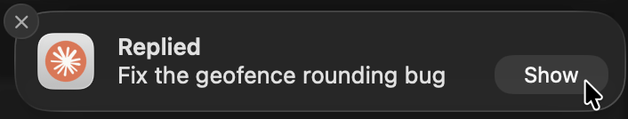

# claude-notify-resume

Desktop notifications for [Claude Code](https://claude.com/claude-code) that
tell you **which conversation** replied — or is waiting on you — and take you
back into it.



*The body is the chat's own name, so you know which session it is.
(Resume it from the **Show** button — see [where the session reopens](#where-the-session-reopens).)*

Run several Claude sessions at once and the usual notification is useless: five
identical banners saying "Claude Code is done", with no clue which repo, which
task, or where to go next. This one names the chat and reopens it when clicked.

## What makes it different

Most Claude Code notifiers title the banner with a static string, the working
directory, or the git branch. Two things here work differently:

- **The banner is titled with the chat's own name** — the AI-generated title you
  see in `/resume`, read from the session transcript. Not the folder, not the
  branch, not a truncated UUID: the actual subject of the conversation.
- **Clicking it resumes that session** (`claude --resume <id>`), rather than
  focusing whichever terminal window happens to still be open. This keeps
  working after you have closed the tab.

Both matter most in exactly the case that breaks other tools: many parallel
sessions across several repos.

The status also says what actually happened, rather than lumping every event
under one word:

| Status | Fires when |
| --- | --- |
| `Replied` | Claude finished responding — every turn, *not* "task complete" |
| `Permission needed` | A tool call is waiting for your approval |
| `Waiting for you` | Claude is idle, awaiting your next prompt |
| `Input needed` | An MCP server opened an elicitation form |
| `Background agent needs you` / `finished` | A background session wants input, or ended |

Deliberately *not* subscribed: `auth_success`, `elicitation_complete`,
`elicitation_response` — they announce things you just watched happen.

## Install

```bash
claude plugin marketplace add anaidenko/claude-notify-resume
claude plugin install claude-notify-resume@anaidenko
```

The same thing works from inside a session as `/plugin marketplace add …` and
`/plugin install claude-notify-resume@anaidenko`; the CLI is shown here because
it prints what it did, which matters when something goes wrong.

Restart Claude Code afterwards — hook config is read at startup.

Third-party marketplaces do not refresh themselves by default, so turn on
auto-update once and new versions arrive on their own: `/plugin` → **Marketplaces**
→ select `anaidenko` → enable auto-update. Claude Code then refreshes shortly
after a session starts and prompts you to `/reload-plugins`.

Without it, updating is two commands:

```bash
claude plugin marketplace update anaidenko
claude plugin update claude-notify-resume@anaidenko
```

**macOS** works out of the box via AppleScript. For click-to-resume, install
the notifier binary:

```bash
brew install terminal-notifier
```

Then build the icon bundle, which gives the banner the Claude icon:

The first banner without the icon offers the setup command as a banner of its
own and copies it to the clipboard, so you can paste it straight into a terminal.
It looks like this:

```bash
~/.claude/plugins/cache/anaidenko/claude-notify-resume/<version>/scripts/setup-macos-icon.sh
```

You then resume a session from the banner's **Show** button — see
[where the session reopens](#where-the-session-reopens).

That script ends by sending a test banner. **If you do not see it**, open
**System Settings → Notifications → Claude Code** and turn on *Allow
notifications*: a newly created bundle starts switched off, and macOS then
discards its banners with no error and a success exit code.

**Linux** needs nothing beyond `notify-send`, which desktop distros ship with
libnotify preinstalled. If yours does not: `sudo apt install libnotify-bin`
(or your distro's package). Without it no banner can appear at all — the hook
stays silent by design rather than interrupting your session.

## Platform support

| Platform | Status | Notes |
| --- | --- | --- |
| macOS | Supported, in daily use | AppleScript out of the box; `terminal-notifier` adds click-to-resume, and optionally the icon |
| Linux | Supported | `notify-send`; tested on Debian + Ubuntu; no click action |
| Windows | Not supported | PRs welcome |

Every path fails silently by design: a notification must never break your
session — if the notifier is missing or the payload is malformed, the hook
exits 0 and says nothing.

```bash
npm test              # native suite for your platform
npm run test:all      # + Linux suites and real-daemon delivery via Docker
npm run notify:demo   # send one real banner
```

The suites run the scripts straight out of the repo — no install, no
dependencies — and never deliver a banner: the notifier binaries are shadowed by
stubs that record their arguments. Delivery itself is verified separately
against a real notification daemon over D-Bus (`npm run test:dbus`). Verified on
**Debian 12** and **Ubuntu 24.04**; per-suite details are in
[CONTRIBUTING.md](CONTRIBUTING.md).

## How it works

Claude Code hands a hook a JSON payload on stdin — `session_id`,
`transcript_path`, `cwd`. The chat name is not in it, so `notify-parse.js`
reads the transcript and takes the last `ai-title` record:

```json
{ "type": "ai-title", "sessionId": "6f960b23-…", "aiTitle": "Fix the geofence rounding bug" }
```

It is re-emitted as the conversation evolves, so the last one wins. This is an
internal record type, not a documented API — if it ever disappears, the banner
falls back to the project directory name.

On macOS the icon needs a detour: the banner's left-hand icon comes from the
**sending application**, and `terminal-notifier`'s `-appIcon` / `-contentImage`
do not affect that slot. So `setup-macos-icon.sh` generates a tiny `.app` that
exists only to own the icon, and passes `-sender`. That flag also swallows the
click on the banner body, which is why resuming happens through **Show**.

| File | Role |
| --- | --- |
| `hooks/hooks.json` | Declares the `Stop` / `Notification` hooks |
| `scripts/notify.sh` | Parses the payload, resolves the chat name, dispatches per platform |
| `scripts/notify-parse.js` | Reads the payload + `ai-title` from the transcript |
| `scripts/notify-macos.sh` | Builds and sends the macOS banner |
| `scripts/notify-linux.sh` | Builds and sends the Linux banner |
| `scripts/open-session.sh` | Reopens a session when a banner is clicked |
| `scripts/load-config.sh` | Reads the config file, letting the environment win |
| `scripts/setup-macos-icon.sh` | Builds the icon bundle (macOS setup) |
| `test/run-tests.sh` | Picks the suite matching your platform |

To fire a banner by hand while debugging, set `CLAUDE_NOTIFY_TEST=1` so it is
prefixed `TEST ·` and never mistaken for a real one:

```bash
echo '{"session_id":"x","transcript_path":"","cwd":"'"$PWD"'"}' \
  | CLAUDE_NOTIFY_TEST=1 scripts/notify.sh "Replied"
```

The marker is `TEST ·` rather than `[TEST]` on purpose: a `-title` starting with
`[` is swallowed by `terminal-notifier`, which silently falls back to its
default title of "Terminal" — the banner still shows, just not the title you
passed.

### Configuration

Nothing needs configuring — the defaults are what the plugin is tuned for. When
you do want to change something, write `~/.claude/claude-notify-resume.conf` (copy
[`claude-notify-resume.conf.example`](claude-notify-resume.conf.example) to start):

```ini
# Statuses you would rather not be told about
MUTE=Replied,Waiting for you

# Force a terminal instead of the detected one: Terminal, iTerm, or vscode
TERMINAL=iTerm
```

| Key | Effect |
| --- | --- |
| `MUTE` | Comma-separated statuses to drop |
| `TERMINAL` | Force `Terminal`, `iTerm`, or `vscode` instead of the detected host |

`Replied` fires on **every** reply — the point when you have walked away, noise
when you are watching the chat. Muting it keeps the ones that actually need you.

Status names are matched case-insensitively, spaces around commas are fine, and
an unknown name is ignored. A malformed file cannot break the hook.

Every key also works as an environment variable prefixed `CLAUDE_NOTIFY_`
(e.g. `CLAUDE_NOTIFY_MUTE`), which overrides the file for a one-off.

### Where the session reopens

Clicking a banner's **Show** button reopens the session in your terminal — iTerm
if that is what you use, otherwise Terminal — detected from the process tree when
the notification is sent, and reusing the tab already running that session
instead of stacking up a window per click.

Show, rather than the banner body, because the two cannot coexist on macOS: the
`-sender` flag that puts the Claude icon on a banner also swallows the body
click. The icon is worth more than the extra hover, so that is the trade this
plugin makes.

Running Claude Code inside VS Code is the one case where the host is
deliberately not followed: VS Code has no scriptable terminal, so the best it
could do is open the folder and leave you to paste the command. Resuming the
conversation is the point, so a VS Code session still gets a real terminal. Set
`TERMINAL=vscode` in the config file if you would rather it opened the folder.

Two things worth knowing about a resumed session:

- It is a *separate* Claude Code process reading the same transcript, not a live
  view of the one you left. Keep talking in the original window and the resumed
  one will not see those messages — it shows the conversation as of the moment
  it started. Resuming again picks up the rest.
- With several sessions notifying, the click target is whichever notified most
  recently: macOS does not tell the app which banner was clicked, so clicking an
  older banner opens the newer session.

## Uninstall

```bash
claude plugin uninstall claude-notify-resume@anaidenko
```

Then, if you built the icon bundle: `scripts/setup-macos-icon.sh remove`

## Built with

No runtime dependencies — the plugin is shell plus one Node script, and
everything below is either already on the machine or optional.

| Area | Used |
| --- | --- |
| Language | Bash (POSIX-leaning, bash 3.2-compatible), Node.js (stdlib only) |
| Integration | Claude Code plugin API — `Stop` / `Notification` hooks, JSONL transcript parsing |
| macOS | `terminal-notifier`, AppleScript (`osascript`), a generated `.app` bundle for the icon |
| Linux | `notify-send` / libnotify, D-Bus |
| Testing | Docker (Debian, Ubuntu), stubbed binaries, a real D-Bus + notification-daemon harness |
| Tooling | shellcheck, npm scripts as the entry point |

## Contributing

Patches welcome — see [CONTRIBUTING.md](CONTRIBUTING.md). The most useful
contribution is a **tested Windows path**, which is the one platform this could
not be verified on.

## License

MIT
